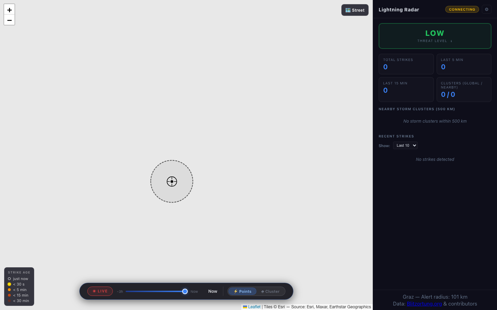

# Lightning Radar

Real-time lightning strike detection and storm tracking system. Receives live
strikes from the [Blitzortung](https://www.blitzortung.org/) network, groups
them into storm cells using HDBSCAN density clustering, and visualises movement
vectors and ETAs on an interactive map.



## Features

- **Live map** — strikes appear within ~1 second, worldwide
- **Storm clusters** — HDBSCAN groups strikes into cells; each cell is drawn
  as a fitted ellipse matching the actual cloud shape
- **Movement vectors** — speed (km/h) and bearing after 8 minutes of tracking
- **Threat level & ETA** — colour-coded indicator and arrival estimate
  for approaching storms
- **Time slider** — replay the last 30 minutes of activity
- **Configurable target** — change the reference city from the Settings panel
  without restarting the server
- **Local SQLite storage** — no cloud account or external database needed

## Quick Start

```bash
conda env create -f environment.yml
conda activate lightning-radar
cd frontend && npm install && cd ..
cp .env.example .env
./start.sh
```

Opens at http://localhost:5173 (map) and http://localhost:8000 (API).

See [DEVELOPMENT.md](DEVELOPMENT.md) for a full setup guide and architecture notes.

## Attribution

Lightning data provided by [Blitzortung.org](https://www.blitzortung.org/) and its contributors.
This is a personal, non-commercial project with no affiliation to the Blitzortung network.

## License

MIT
