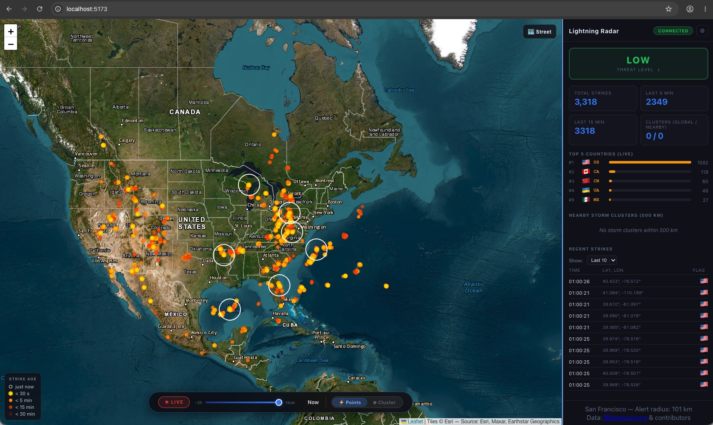

# Lightning Radar

Real-time lightning strike detection and storm tracking system. Receives live
strikes from the [Blitzortung](https://www.blitzortung.org/) network, groups
them into storm cells using HDBSCAN density clustering, and visualises movement
vectors and ETAs on an interactive map.



## Features

### Live map
Every lightning strike detected anywhere in the world appears on the map within
about one second of it happening. Strikes fade out automatically after 30 minutes
so the display always reflects current activity.

### Storm clusters
Individual strikes are grouped into storm cells automatically. Instead of drawing
a simple circle around each group, the map fits an ellipse to the actual shape of
the strike cloud — so an elongated squall line looks like one, not a blob. Each
cluster updates its shape every 60 seconds as new strikes arrive.

### Movement arrows
Once a storm has been tracked for at least eight minutes, the app estimates how
fast it is moving and in which direction. An arrow on the cluster shows the bearing
and a label shows the speed in km/h. A Kalman filter smooths out noise in the
centroid position before the velocity is computed.

### Threat level & ETA
A colour-coded indicator (🟢 LOW → 🔴 CRITICAL) in the sidebar tells you at a
glance whether any active storm is heading your way. When a cluster is on an
approach trajectory, the app calculates an estimated time of arrival (ETA) and
shows it in the cluster list.

### Time slider
Drag the slider backwards to replay what the last 30 minutes of activity looked
like — useful for understanding how a storm developed and where it came from.

### Configurable target
The "target" location is the reference point for distances, alerts, and ETAs.
It defaults to Vienna but can be changed to any city in the Settings panel without
restarting the server.

### Local storage
All strikes are written to a local SQLite database as they arrive. No cloud
account or external database is needed.

## Architecture

```
lightning/
├── backend/
│   └── app/
│       ├── main.py                     # FastAPI app, lifespan, WebSocket broadcast
│       ├── core/
│       │   ├── config.py               # Runtime-mutable config dataclass
│       │   ├── database.py             # SQLite helpers
│       │   └── utils.py                # Haversine, LZW decompression
│       ├── services/
│       │   ├── blitzortung.py          # Blitzortung WebSocket client
│       │   ├── cluster_tracker.py      # HDBSCAN + Kalman + WLS velocity
│       │   └── connection_manager.py   # Browser WebSocket fan-out
│       ├── models/schemas.py
│       └── api/routes.py
│
├── frontend/
│   └── src/
│       ├── App.jsx                     # Root: state, WebSocket, routing
│       └── components/
│           ├── StrikeMap.jsx           # Leaflet map, ellipses, arrows
│           ├── Dashboard.jsx           # Stats, clusters, recent strikes
│           ├── SettingsPanel.jsx       # Target / radius settings
│           └── TimeSlider.jsx          # Live / historical toggle
│
├── environment.yml                     # Conda environment (Python + Node)
├── start.sh                            # One-command dev launcher
├── build.sh                            # Production build
└── .env.example                        # Config reference
```

## Quick Start

### Prerequisites

- [Miniconda](https://docs.conda.io/en/latest/miniconda.html) or Anaconda
- Internet access for the Blitzortung WebSocket feed

### 1. Create the environment

```bash
conda env create -f environment.yml
conda activate lightning-radar
```

### 2. Install frontend dependencies

```bash
cd frontend && npm install && cd ..
```

### 3. Configure

```bash
cp .env.example .env
# Edit .env to set your target location (default: Vienna, Austria)
```

### 4. Launch

```bash
./start.sh
```

Opens:
- **Map + dashboard**: http://localhost:5173 (Vite dev server with HMR)
- **Backend API**: http://localhost:8000

## Configuration

| Variable | Default | Description |
|---|---|---|
| `TARGET_NAME` | `Vienna` | Display name for the target location |
| `TARGET_LAT` / `TARGET_LON` | `48.21` / `16.37` | Target coordinates |
| `OBS_RADIUS_KM` | `500` | Radius for cluster display and stats |
| `ALERT_RADIUS_KM` | `50` | Radius for threat level CRITICAL threshold |
| `WS_PORT` | `8000` | Backend port |
| `DB_PATH` | `data/lightning.db` | SQLite database path (relative to `backend/`) |

Runtime changes (target location, radii) can be applied through the **Settings** panel in the UI without restarting.

## WebSocket Protocol

All real-time data flows over a single WebSocket at `ws://localhost:8000/ws`.

**Initial snapshot** (on connect):

```json
{ "type": "init", "total_strikes": 42000, "settings": {}, "recent_strikes": [], "clusters": [] }
```

**Strike event**:

```json
{ "type": "strike", "lat": 47.5, "lon": 15.3, "time_ms": 1716547200000, "country": "AT", "db_total": 42001 }
```

**Cluster update**:

```json
{
  "type": "cluster",
  "id": 3,
  "lat": 47.2, "lon": 15.1,
  "strike_count": 120,
  "speed_kmh": 45.5, "bearing_deg": 270,
  "eta_hours": 0.8,
  "dist_to_target_km": 36.2,
  "shape": { "a_km": 42.1, "b_km": 18.3, "angle_deg": 110 }
}
```

**Cluster removed**:

```json
{ "type": "cluster_removed", "id": 3 }
```

## Production Build

```bash
./build.sh                     # builds frontend into backend/dist/
conda activate lightning-radar
cd backend && uvicorn app.main:app --host 0.0.0.0 --port 8000
```

The backend serves the compiled frontend from `dist/`; no separate Node process needed in production.

## Tech Stack

| Layer | Technology |
|---|---|
| Backend | Python 3.11, FastAPI, uvicorn (async) |
| Clustering | scikit-learn HDBSCAN |
| Tracking | Kalman filter (numpy) + WLS velocity |
| Data feed | Blitzortung WebSocket (LZW compressed) |
| Storage | SQLite |
| Frontend | React 18, Vite, Leaflet |
| Linting | Ruff (Python), ESLint 10 + react-hooks (JS) |

## Attribution

Lightning data provided by [Blitzortung.org](https://www.blitzortung.org/) and its contributors.
This is a personal, non-commercial project with no affiliation to the Blitzortung network.

## License

MIT
